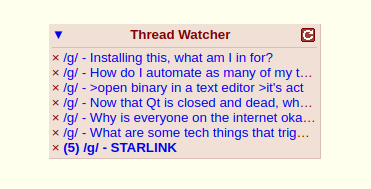
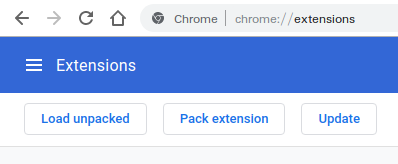

# Auto Watch



### Overview

This is a Chrome extension that adds three very simple pieces of functionality to the Thread Watcher.

1. Automatically adds threads you post in to the Watch List
2. Adds a button to minimize/collapse the Thread Watcher
3. Automatically refreshes the thread watcher and indicates updates via the header text

##### Doesn't 4chanX already do this?
For feature number 1 and 3, yes it does. For feature number 2, I'm not sure and I don't really care to find out.
I installed 4chanX exclusively for feature number 1. Instead it completely nuked the native settings
window with 1000 extra features I don't care about. So I wrote this instead.

##### B-b-but I don't wanna use Chrome!
There is absolutely nothing about the content script `aw.js` that is bound to Chrome to operate. You can very easily
just take `aw.js` and execute it on its own and everything will work the same. 


### Installation
Since this is not getting published to the Chrome Extension store, you'll need to load this
as an unpacked extension. You can do this by heading to `chrome://extensions`, selecting "Load Unpacked"
and then selecting this folder. 




### Configuration
There are four configurable settings for this extension that are located in the content script 
`aw.js`. They are defaulted at

```
    RefreshIntervalSeconds : 15,
    RefreshOnlyWhenMinimized : false,
    ShowErrors : true,
    ShowLogs : true,
```

Feel free to change these. 


### Contributing
This extension is incredibly simple. If you absolutely feel the need to add bloat and turn it
into 4chanX, please fork this repo and have at it. If you find a bug, feel free to fix it.  
